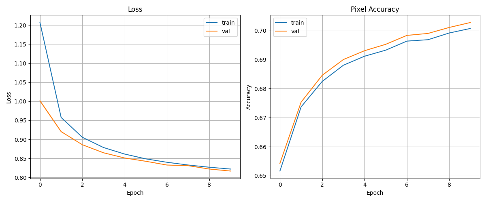
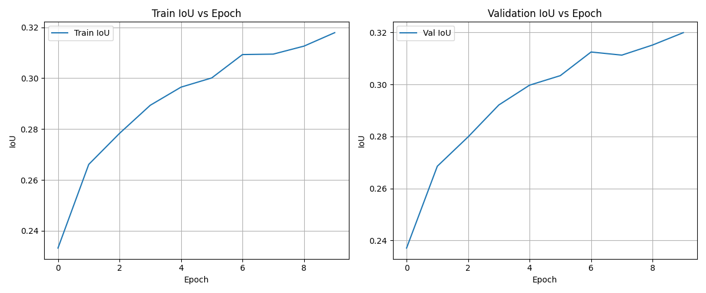
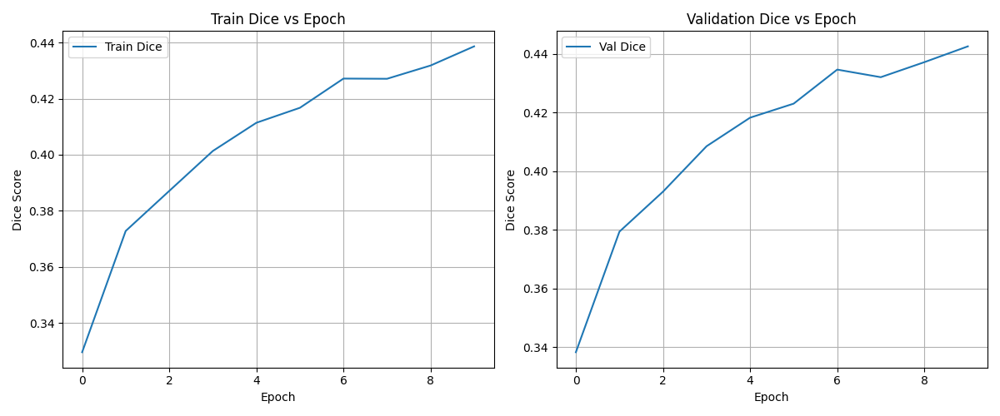

# Offroad Segmentation - Training Results

## Performance Metrics
| Metric | Value |
| :--- | :--- |
| **Final Val Loss** | 0.8170 |
| **Final Val IoU** | 0.3199 |
| **Final Val Dice** | 0.4426 |
| **Final Val Accuracy** | 0.7028 |

## Training Visualizations

## Summary
The model was trained using DINOv2 (vits14) for offroad segmentation. The final accuracy reached approximately 70% after 10 epochs.